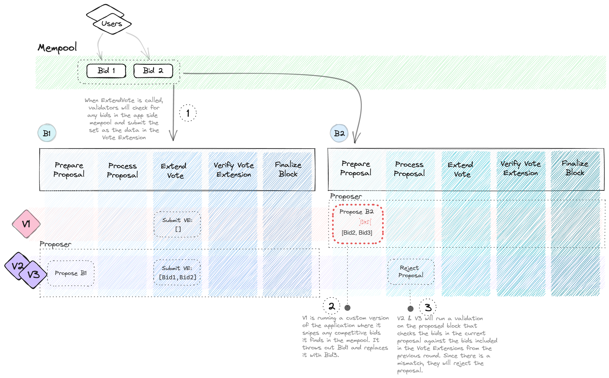

# ABCI++ Workshop

Joint workshop between [Cosmos SDK](https://docs.cosmos.network/main) and [CometBFT](https://cometbft.com/) for [Hackmos](https://cosmoverse.org/hackmos) at [Cosmoverse](https://cosmoverse.org/).

Supported by [Informal Systems](https://informal.systems/) and [Binary Builders](https://binary.builders/).

## Concepts
**Overview**

The goal of this workshop is to demonstrate to developers how they might think about utilizing ABCI++ and new features in the Eden release of the Cosmos SDK.

In part 1, we explore the application and discuss a potential vector for MEV by leveraging custom block building in `PreparePropsoal` for a chain running perpetual nameservice auctions.

In part 2 and 3, we build a solution to mitigate auction front running by extending functionality in `ExtendVote`, `PrepareProposal`, and `ProcessProposal`. This solution assumes an honest 2/3 majority of validators are not colluding to front run transactions.

At **H-1** during `ExtendVote`, we check the mempool for unconfirmed transactions and select all auction bids. Validators submit their Vote Extension with a list of all bids available in their mempool.
Additionally we implement a custom app side `ThresholdMempool`, which guarantees that transactions can only be included in a proposal if they have been seen by `ExtendVote` at H-1.

At **H** during `PrepareProposal`, the validator will process all bids included in Vote Extensions from H-1. It will inject this result into a Special Transaction to be included in the proposal.
During the subsequent `ProcessProposal`, validators will check if there are any bid transactions. Bids included in the proposal will be validated against the bids included in the Special Transaction.
If a bid included in the proposal does not meet the minimum threshold of inclusion frequency in Vote Extensions from H-1, the proposal is rejected.



## Content

#### [Introduction](#intro)
- Getting Started
- Exploring MEV Mitigation

#### [Part 1](#part_1)
1. Submit Proof of Existence with Vote Extensions
2. Winning the Race: Modifying the Mempool

#### [Part 2](#part_)
1. Collating Evidence in Prepare Proposal
2. Detecting & Deflecting Misbehavior with Process Proposal

<hr>

## Intro

**Content**
- ABCI++ Overview
- Tour of App
- Understanding the Problem

#### ABCI++ Overview
- CometBFT changes in protocol from ABCI -> ABCI++
  - ABCI: BeginBlock, DeliverTx, EndBlock moved to Finalize Block
  - Addition of ExtendVote during PreCommit phase
- Additional Features in v0.50 Eden
  - Optimistic Execution: https://github.com/cosmos/cosmos-sdk/pull/16581
  - Vote Extensions: https://docs.cosmos.network/main/build/architecture/adr-064-abci-2.0#voteextensions
  - Module updates:
       https://github.com/cosmos/cosmos-sdk/blob/release/v0.50.x/UPGRADING.md#modules

#### Tour of the App
- How to configure:
  - App side mempool
  - Vote Extensions
    - Consensus Params
    - App Opts
  - Prepare Proposal Handler
  - Process Proposal Handler

### Understanding the Problem
- Diagram Overview
- Demos
  - Part 1
  - Final Solution
- Code Walkthrough

<hr>

## Part 1

In the first part we'll configure vote extensions to peek into the mempool and submit a list of all unconfirmed bids.

Then we'll verify that we can access the list of unconfirmed transactions in the `abci.RequestPrepareProposal` during the following block. Vote Extensions can be found in `LocalLastCommit`.

**1. Create Vote Extension Handler**
In `/abci/proposal.go`
```go
func (h *VoteExtHandler) ExtendVoteHandler() sdk.ExtendVoteHandler {
	return func(ctx sdk.Context, req *abci.RequestExtendVote) (*abci.ResponseExtendVote, error) {

      // Get unconfirmed transactions from mempool

      // Iterate through reaped transactions, msgs and check for bids

      // Move tx to ready pool
		
      // Create vote extension
      
      // Marshal Vote Extension
		
	 // Return RequestExtendVote
    }
}
```

**2. Configure Handler in App**
In `/app/app.go`
```go
bApp := baseapp.NewBaseApp(AppName, logger, db, txConfig.TxDecoder(), baseAppOptions...)

...
// 
voteExtHandler := abci2.NewVoteExtensionHandler(logger, mempool, appCodec)
bApp.SetExtendVoteHandler(voteExtHandler.ExtendVoteHandler())
```

**3. Validate Vote Extensions propagagted**
We want to add the following to the `PrepareProposalHandler` to print out and test our vote extensions have entere
```go

if req.Height > 2 {  
   voteExt := req.GetLocalLastCommit()  
   h.logger.Info(fmt.Sprintf("🛠️ :: Get vote extensions: %v", voteExt))  
}

```


<hr>

## Part 2

In the second part, in **Prepare Proposal** we'll process the vote extensions from the previous round and inject them into the proposal via a special transaction.

In **Process Proposal**, if a proposal contains a bid, we examine the bids in the special transaction and verify that this bid has been included in the previous height's vote extensions.

**1. Process Vote Extensions in Prepare Proposal**
```go
func (h *PrepareProposalHandler) PrepareProposalHandler() sdk.PrepareProposalHandler {
	return func(ctx sdk.Context, req *abci.RequestPrepareProposal) (*abci.ResponsePrepareProposal, error) {

      // Get VE from ProposedLastCommit

      // Get Special Transaction

      // Append Special Transaction to proposal
}
```


**2. Create Process Proposal Handler**
```go
func (h *ProcessProposalHandler) ProcessProposalHandler() sdk.ProcessProposalHandler {
	return func(ctx sdk.Context, req *abci.RequestProcessProposal) (resp *abci.ResponseProcessProposal, err error) {

        // The first transaction will always be the Special Transaction
        
        // But we want to first check if the proposal has any transactions

        // Double check if the first transaction is the special transaction and if it is we always want to Unmarshal

        // Check if there are any bids in the Special Transaction

        // Unmarshal the bids

        // Validate these bids
    }
}
```

**3. Configure Process Proposal Handler in App**
In `/app/app.go`
```go
processPropHandler := abci2.ProcessProposalHandler{app.txConfig, appCodec, logger}
bApp.SetProcessProposal(processPropHandler.ProcessProposalHandler())
```

If you want to validate the bids such as we have in this example you must ensure you do the following:

- Decode the proposal transactions and extract the bids
- Map bid frequencies, where the number of times the bid appears in the VE is stored
-  Figure out how many votes are needed for a bid to be considered valid
- Iterate over the bids in the proposal and check if each bid appears in the VE at least as many times as the threshold count (for the threshold count we will need to implement the `ThresholdMempool`)

## [Demo](https://github.com/fatal-fruit/abci-workshop#demo)

#### 3 Validator Network
In the 3 validator network, the Beacon validator has a custom transaction provider enabled.
It might take a few tries before the transaction is picked up and front ran by the Beacon.

After submitting the following transaction, we should be able to see the proposal accepted or rejected in the logs.
Note that it is best to submit the transaction after the Beacon has just proposed a successful proposal.
```shell
./scripts/reserve.sh "bob.cosmos"
```
Query to verify the name has been reserved
```shell
./scripts/whois.sh "bob.cosmos"
```
If the Beacon attempts to front run the bid, we will see the following logs during `ProcessProposal`
```shell
2:47PM ERR ❌️:: Detected invalid proposal bid :: name:"bob.cosmos" resolveAddress:"cosmos1wmuwv38pdur63zw04t0c78r2a8dyt08hf9tpvd" owner:"cosmos1wmuwv38pdur63zw04t0c78r2a8dyt08hf9tpvd" amount:<denom:"uatom" amount:"2000" >  module=server
2:47PM ERR ❌️:: Unable to validate bids in Process Proposal :: <nil> module=server
2:47PM ERR prevote step: state machine rejected a proposed block; this should not happen:the proposer may be misbehaving; prevoting nil err=null height=142 module=consensus round=0
```

#### Single Node

```shell
./build/cosmappd tx ns reserve "bob.cosmos" $(./build/cosmappd keys show alice -a --keyring-backend test) 1000uatom --from $(./build/cosmappd keys show bob -a --keyring-backend test) -y
```
Query to verify the name has been reserved.

If running the provider on the `part-1-2` branch, we can see that the owner and resolve address are different than the original transaction we submitted.
```shell
./build/cosmappd q ns whois "bob.cosmos" -o json

./build/cosmappd keys list --keyring-backend test --output json | jq
```

## Resources

Official Docs
- [CometBFT](https://docs.cometbft.com/v0.37/)
- [Cosmos SDK](https://docs.cosmos.network/main)

ABCI++
- [ACBI++ Spec: Basic Concepts](https://github.com/cometbft/cometbft/blob/main/spec/abci/abci++_basic_concepts.md#consensusblock-execution-methods)
- [ABCI++ Spec: Application Requirements](https://github.com/cometbft/cometbft/blob/main/spec/abci/abci%2B%2B_app_requirements.md)
- [Skip's POB Article](https://ideas.skip.money/t/x-builder-the-first-sovereign-mev-module-for-protocol-owned-building/57)
- Videos
  - [Sergio from Informal: Presentation on ABCI++](https://youtube.com/watch?v=cAR57hZaJtM)
  - [Evan from Celestia: Possible Applications of ABCI++](https://www.youtube.com/watch?v=VGdIZLVYoRs)

Building Applications
- [Facu from Binary Builders: Building Cosmos SDK Modules](https://www.youtube.com/watch?v=9kK9uzwEeOE)
- [Interchain Developer Academy Playlist](https://www.youtube.com/watch?v=1_ottIKPfI4&list=PLE4J1RDdNh6sTSDLehUpp7vqvm2WuFWNU&pp=iAQB)
- [Cosmod's Basic module template](https://github.com/cosmosregistry/example)